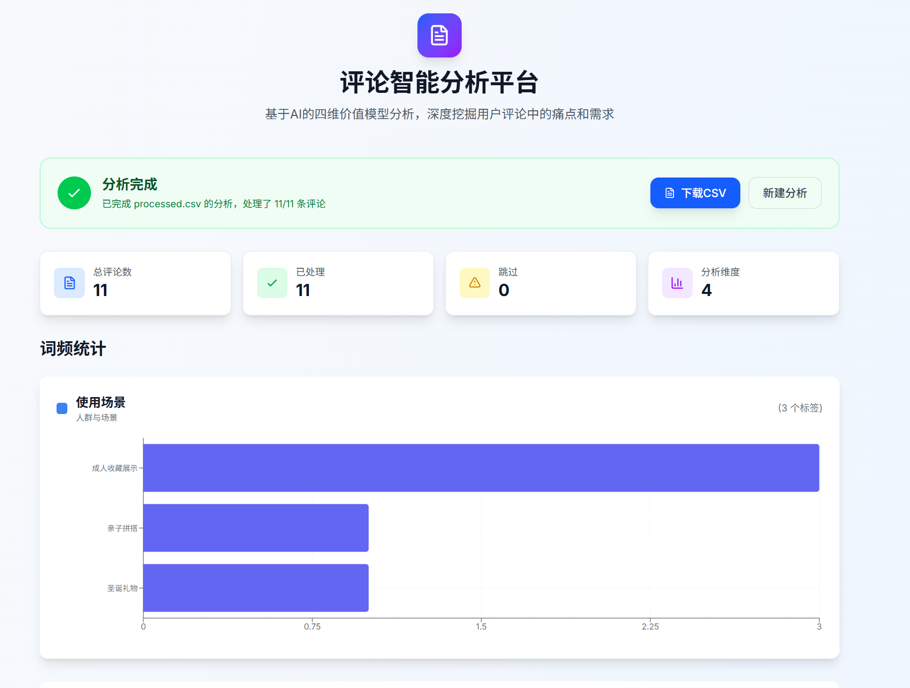
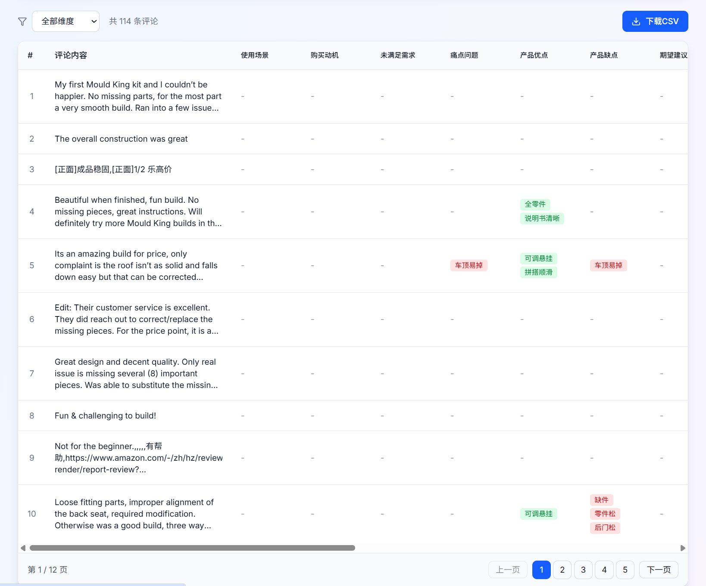

[English](./README.EN.md) | 中文

# easy-amazon-voc - 评论智能分析平台


一个基于AI的评论分析平台，帮助企业和产品团队从用户评论中深度挖掘痛点和需求，生成多维度标签分析和用户画像。分为typescript版本和python版本。 

## 试试做一个 shulex VOC（客户之声）:
 针对amazon商品评论进行AI大模型分析的项目。利用AI对评论进行多维度的数据分析。操作流程为：用户利用easy scraper浏览器插件爬取amazon商品评论，然后直接上传csv文件到系统，系统进行评论分析，然后提供下载链接，下载更新的带有评论分析的csv文件。

## 功能特性

### 🎯 核心功能

#### 智能评论分析
- **CSV文件上传**：支持上传包含用户评论的CSV文件
- **AI两步分析**：
  1. **标签体系生成**：基于四维价值模型自动构建标签体系
  2. **逐条评论打标**：为每条评论匹配标签并判断情感倾向
- **多维度分析**：基于四维价值模型进行全面分析
- **中英双语支持**：支持中文和英文评论分析

#### 四维价值模型
```
人群与场景
├── 使用场景 - 用户在什么情况下使用产品
├── 购买动机 - 为什么购买这个产品
├── 未被满足的需求 - 还有什么需求没有被满足
└── 痛点问题 - 用户遇到的问题和困扰

功能价值
├── 产品优点 - 用户认可的优点
├── 产品缺点 - 用户抱怨的缺点
├── 期望建议 - 用户希望改进的地方
└── 设计与外观 - 对产品外观的评价

保障价值
├── 物流配送 - 配送速度、包装等
├── 售后服务 - 维修、退换货等
└── 售前服务 - 咨询、介绍等

体验价值
├── 推荐意愿原因分析 - 为什么愿意/不愿意推荐
├── 是否愿意推荐给他人 - 推荐意愿
├── 品牌印象 - 对品牌的认知
├── 感官感受 - 外观、触感、声音等
└── 价格感知 - 对价格的评价
```

#### 高级分析功能
- **词频统计**：自动统计各标签的出现频率
- **情感分析**：自动识别正面/负面评价
- **用户画像生成**：基于评论生成3-5个典型用户画像
- **数据可视化**：图表展示词频统计结果

#### 导出功能
- **分析结果导出**：下载带标签的CSV文件
- **用户画像导出**：导出Markdown格式的用户画像

## 技术栈

| 类别 | 技术 |
|------|------|
| 前端框架 | Next.js 15 + React 19 |
| 样式 | Tailwind CSS 4 |
| 国际化 | next-intl |
| 数据请求 | SWR (轮询任务状态) |
| 后端 | Next.js API Routes |
| AI分析 | OpenAI兼容API (支持GPT-4o、GLM-4.6等) |
| 数据处理 | TypeScript + Node.js |
| 可视化 | Recharts |

## 快速开始

### 环境要求

- Node.js >= 18
- npm 或 pnpm

### 1. 安装依赖

```bash
# 克隆项目
git clone https://github.com/liangdabiao/easy-amazon-voc-ai.git
cd easy-amazon-voc-ai

# 安装依赖
npm install
```

### 2. 配置环境变量

```bash
cp .env.example .env
```

编辑 `.env` 文件：

```env
# OpenAI兼容API配置 (必需)
OPENAI_API_KEY=your_api_key_here
OPENAI_BASE_URL=https://api.openai.com/v1
OPENAI_MODEL=gpt-4o
```

支持的API提供商：
- **OpenAI**：直接使用OpenAI API
- **kimi、智谱AI**：设置 `OPENAI_BASE_URL=https://open.bigmodel.cn/api/paas/v4`，`OPENAI_MODEL=glm-4.6`
- **其他兼容接口**：根据服务商提供配置

### 3. 运行项目

```bash
# 开发模式
npm run dev

# 生产构建
npm run build
npm run start
```

访问 http://localhost:3000 ，

根目录demo-data.csv 可以作为测试上传数据

## 使用指南

### 1. 准备CSV文件

准备包含用户评论的CSV文件（根目录demo-data.csv 可以作为测试上传数据），系统支持多种列名：

**中文列名**：
- 评论内容
- 评论
- 内容
- review_content
- review
- comment
- content
- body
- text

**英文列名**：
- review_content
- review
- comment
- content
- body
- text
- message

### 2. 上传和分析

1. 点击上传区域选择CSV文件，或拖拽文件到上传区
2. 选择分析语言（中文/英文）
3. 点击"开始分析"按钮
4. 等待分析完成（可能需要几分钟）

### 3. 查看结果

分析完成后，您可以查看：
- **统计信息**：总评论数、处理数、跳过数
- **词频统计**：按四维价值模型展示的词频图表
- **用户画像**：3-5个典型用户画像
- **下载结果**：点击下载按钮获取带标签的CSV文件

### 4. 数据导出

#### 分析结果CSV
包含原始数据，并新增以下列：
- 用户需求与痛点-使用场景
- 用户需求与痛点-购买动机
- 用户需求与痛点-未被满足的需求
- 用户需求与痛点-痛点问题
- 产品反馈-产品优点
- 产品反馈-产品缺点
- 产品反馈-用户期望建议
- 产品反馈-设计与外观
- 服务评价-物流配送
- 服务评价-售后服务
- 服务评价-售前服务
- 品牌形象与口碑-推荐意愿原因分析
- 品牌形象与口碑-是否愿意推荐给他人
- 品牌形象与口碑-品牌印象
- 感官感受
- 价格感知

## 项目结构

```
easy-amazon-voc-ai/
├── src/
│   ├── app/                     # Next.js App Router
│   │   ├── [locale]/           # 国际化动态路由
│   │   │   └── page.tsx        # 主页 - 评论分析
│   │   ├── layout.tsx          # 根布局
│   │   └── api/                # API路由
│   │       ├── comment-analysis/  # 评论分析API
│   │       ├── jobs/[jobId]/     # 任务状态查询
│   │       └── health/           # 健康检查
│   ├── components/             # React组件
│   │   ├── CommentAnalysisForm.tsx    # 分析表单
│   │   ├── FileUploadZone.tsx         # 文件上传
│   │   ├── WordFrequencyChart.tsx      # 词频图表
│   │   ├── PersonaDisplay.tsx          # 用户画像
│   │   ├── CommentResultsTable.tsx     # 结果表格
│   │   └── ...
│   ├── messages/               # 国际化翻译
│   │   ├── zh.json               # 中文翻译
│   │   └── en.json               # 英文翻译
│   ├── middleware.ts           # 国际化中间件
│   └── lib/
│       └── design-tokens.ts     # 设计系统标记
├── lib/                       # 后端服务和工具
│   ├── services/              # 核心业务逻辑
│   │   ├── comment-analysis-service.ts  # AI分析服务
│   │   ├── comment-job-manager.ts       # 任务管理
│   │   └── word-frequency-service.ts    # 词频统计
│   ├── utils/                 # 工具函数
│   │   ├── csv-parser.ts      # CSV解析
│   │   └── csv-generator.ts   # CSV生成
│   └── prompts/               # AI提示词
│       └── analysis-prompts.ts # 提示词模板
├── test-data/                # 测试数据
│   ├── sample-reviews.csv    # 示例评论文件
│   └── api-test.ts           # API测试脚本
├── .env.example              # 环境变量模板
├── package.json
└── tsconfig.json
```

## API配置

### OpenAI兼容API（必需）

本项目支持任何OpenAI兼容的API接口：

#### OpenAI
1. 注册账号：https://platform.openai.com/
2. 创建API Key
3. 配置：
```env
OPENAI_API_KEY=sk-xxx
OPENAI_BASE_URL=https://api.openai.com/v1
OPENAI_MODEL=gpt-4o
```

#### 智谱AI (GLM)
1. 注册账号：https://open.bigmodel.cn/
2. 创建API Key
3. 配置：
```env
OPENAI_API_KEY=your_glm_api_key
OPENAI_BASE_URL=https://open.bigmodel.cn/api/paas/v4
OPENAI_MODEL=glm-4.6
```

#### 其他兼容接口
根据您使用的服务商配置相应的`OPENAI_BASE_URL`和`OPENAI_MODEL`。

## 使用限制

| 限制项 | 数值 | 说明 |
|--------|------|------|
| 单文件最大大小 | 16MB | 避免上传过大文件 |
| 单次最大评论数 | 300条 | 确保处理性能 |
| 支持的文件格式 | CSV | 仅支持UTF-8或GBK编码 |

## 常见问题

### Q: 分析速度慢怎么办？
A: 分析速度取决于AI API的响应速度。每条评论需要一次AI调用，请耐心等待。建议减少评论数量或使用更快的API模型。

### Q: 支持哪些语言的评论？
A: 目前支持中文和英文评论分析，系统会自动检测语言。

### Q: 标签体系可以自定义吗？
A: 目前标签体系由AI自动生成，基于四维价值模型。未来版本可能支持自定义标签体系。

### Q: 分析结果准确吗？
A: 分析结果基于AI模型的理解能力，准确率通常较高。建议结合人工判断进行最终决策。

### Q: 数据隐私如何保障？
A:
- 评论数据仅用于AI分析，不会存储
- 处理后的文件会定期清理
- API调用遵循服务商的隐私政策


 
 
## 示例图
### 运行 ,处理中：


每一个review 标签分析得到的json： 
```json
{
    "人群场景": {
        "用户需求与痛点-使用场景": [
            "汽车爱好者",
            "儿童玩乐",
            "成人收藏",
            "节日礼物"
        ],
        "用户需求与痛点-购买动机": [
            "价格优势",
            "设计喜欢",
            "替代乐高"
        ]
    },
    "功能价值": {
        "产品反馈-产品优点": [
            "零件齐全",
            "组装容易",
            "设计精美",
            "功能多样",
            "细节丰富"
        ],
        "产品反馈-产品缺点": [
            "零件缺失",
            "零件松动",
            "组装困难",
            "指示不明",
            "零件变形",
            "零件质量差"
        ],
        "产品反馈-用户期望建议": [
            "优化指示",
            "提升质量",
            "改进包装"
        ],
        "产品反馈-设计与外观": [
            "整体造型",
            "内部细节",
            "颜色搭配"
        ]
    },
    "保障价值": {
        "服务评价-物流配送": [
            "配送速度"
        ],
        "服务评价-售后服务": [
            "补发零件",
            "退款处理"
        ],
        "服务评价-售前服务": [
            "信息咨询"
        ]
    },
    "体验价值": {
        "品牌形象与口碑-推荐意愿原因分析": [
            "性价比高",
            "组装乐趣"
        ],
        "品牌形象与口碑-是否愿意推荐给他人": [
            "是",
            "否"
        ],
        "品牌形象与口碑-品牌印象": [
            "质量一般",
            "价格实惠"
        ],
        "感官感受": [
            "外观美感",
            "零件质感"
        ],
        "价格感知": [
            "价格合理",
            "价格昂贵"
        ]
    }
}
```
 

### 处理完成后得到更新的评论分析文件（带有多维度标签分析）：





### 怎样利用和进行评论分析（用excel打开，第一列进行筛选，就得到如下）：


### easy scraper 插件爬取amazon商品评论：
插件地址： https://chromewebstore.google.com/detail/cljbfnedccphacfneigoegkiieckjndh
进入amazon商品评论页面，点击插件图标，选择爬取评论，然后选择爬取的评论数量，点击开始爬取，然后点击导出，选择csv格式，导出评论。https://www.amazon.com/-/zh/product-reviews/B0014C0LUC/ref=cm_cr_dp_d_show_all_btm?ie=UTF8&reviewerType=all_reviews

直接下载所有评论，直接系统上传，什么都不用做，得到评论多维度分析结果。
 

### 实现原理
1. 数据爬取：使用easy scraper浏览器插件爬取amazon商品评论。
2. 数据处理：使用python进行评论分析，分析得到多维度标签。首先对全部评论内容进行一次汇总性的标签体系建设，得到标签完整体系，然后对每个评论内容进行标签分析，得到每个评论内容的具体标签。最后，因为得到的数据结构已经可以进行其他方面的自定义数据分析，可以利用powerBi等工具轻易进行评论分析。
3. 数据展示：使用flask框架+echart进行数据展示， TODO

 

## 官方支持
如果您在使用过程中遇到任何问题，请随时联系我们的官方支持团队。您可以通过以下方式联系我们：
如果您在使用过程中遇到任何问题，请随时联系我们的官方支持团队。您可以通过以下方式联系我们：
- 邮箱EMAIL- 邮箱：497070928@qq.com
- 官网- liangdabiao.com
